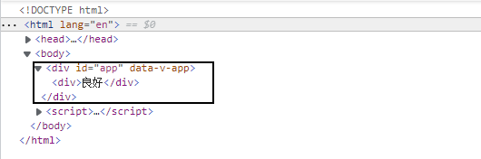
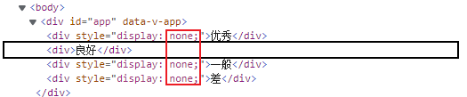

# 3. 指令

指令 (`Directives`) 是带有 `v-` 前缀的特殊属性作用：当表达式的值改变时，将其产生的连带影响，响应式地作用于 `DOM`,在基础部分，我们要学习以下六类指令:

* 内容渲染指令
* 条件渲染指令
* 列表渲染指令
* 属性绑定指令
* 事件绑定指令
* 双向绑定指令

## 3.1 内容渲染指令

::: tip 目标
掌握内容渲染指令以及他们的区别
:::

### 3.1.1 `v-text` 指令

`v-text`指令，用来渲染DOM元素的文本内容，类似于JavaScript DOM中的`innerText`

**特点：**

1. `v-text` 指令会覆盖元素内默认的内容
2. `v-text` 指令不能解析标签

```html{3-8,15-20}
<body>
  <div id="app">
    <!-- 正常数据 -->
    <p v-text="username"></p>
    <!-- p标签中存在内容 -->
    <p v-text="gender">性别</p>
    <!-- 含有html标签的数据 -->
    <div v-text="book"></div>
  </div>
  <script>
    const vm = Vue.createApp({
      data() {
        return {
          // 正常数据
          username: 'WanLum',
          // p标签中存在内容
          gender: '男',
          // 含有html标签的数据
          book: '<h2>谁动了我的奶烙</h2>'
        }
      }
    });
    vm.mount('#app');
  </script>
</body>
```

### 3.1.2 插值表达式 `{{}}`

数据绑定最常见的形式就是使用“Mustache”语法 (双大括号) 的文本插值：

**特点：**

1. 它不会覆盖元素中默认的文本内容。
2. **不能在标签的属性中使用插值表达式**

```html{1}
<span>Message: {{ username }}</span>

<script>
 //  ...省略代码
     data() {
       return {
         username: 'WanLum'
       }
     }
   });
 // ...省略代码
</script>
```

Mustache 标签将会被替代为对应数据对象上 msg property 的值。
无论何时，绑定的数据对象上 msg property 发生了改变，插值处的内容都会更新。

### 3.1.3 `v-html` 指令

如果要把包含 HTML 标签的字符串渲染为页面的 HTML 元素， 你可能要用到 `v-html` 这个指令。

**特点：**

1. 它不会覆盖元素中默认的文本内容。
2. 在生产环境中动态渲染HTML是非常危险的，因为容易导致`XSS`攻击。所以**只能在可信的内容上使用**`v-html`

```html{1,7}
<p v-html="discription"></p>

<script>
 //  ...省略代码
     data() {
       return {
         discription:'<h2 style="color: red;">书山有路勤为径，学海无涯苦作舟</h2>'
       }
     }
   });
 // ...省略代码
</script>
```

### 3.1.4 总结

::: danger 总结

* 插值表达式{{}}，v-text 和 v-html的区别是什么

:::

## 3.2 条件渲染指令

条件渲染指令用来辅助开发者按需控制 虚拟DOM 是否被编译为真实DOM。

::: tip 目标
掌握条件渲染指令以及他们的区别
:::

### 3.2.1 `v-if`/`v-else-if`/`v-else` 指令

`v-if`/`v-else-if`/`v-else`指令,条件为真，元素将会被渲染，条件 为假，元素会被销毁

```html
  <body>
  <div id="app">
    <div v-if="type === 'A'">优秀</div>
    <div v-else-if="type === 'B'">良好</div>
    <div v-else-if="type === 'C'">一般</div>
    <div v-else>差</div>
  </div>
  <script>
    const vm = Vue.createApp({
      data() {
        return {
          type: 'B'
        }
      }
    });
    vm.mount('#app');
  </script>
</body>
```

**效果：**



### 3.2.2 `v-show` 指令

`v-show`也能控制元素的显示和隐藏, 只是`v-show`简单的控制元素的 display 属性

```html{3-6, 12}
<body>
  <div id="app">
    <div v-show="type === 'A'">优秀</div>
    <div v-show="type === 'B'">良好</div>
    <div v-show="type === 'C'">一般</div>
    <div v-show="type === 'D'">差</div>
  </div>
  <script>
    const vm = Vue.createApp({
      data() {
        return {
          type: 'B'
        }
      }
    });
    vm.mount('#app');
  </script>
</body>

```

**效果：**



### 3.2.3 总结

::: danger 面试题

**`v-if`/`v-else-if`/`v-else` 指令和 `v-show` 指令的异同点是什么?**

1. **共同点：**

    * `v-if` 和 `v-show` 都能实现元素的显示隐藏

2. **不同点：**

    * `v-show` 只是简单的控制元素的 `display` 属性，而 `v-if` 才是条件渲染（条件为真，元素将会被渲染，条件 为假，元素会被销毁）；
    * `v-show` 有更高的首次渲染开销，而 `v-if` 的首次渲染开销要小的多；
    * `v-if` 有更高的切换开销，`v-show` 切换开销小；
    * `v-if` 有配套的 `v-else-if` 和 `v-else`，而 `v-show` 没有；
    * `v-if` 可以搭配 `template` 使用，而 v-show 不行；
:::

## 3.3 列表渲染指令

在Vue中我们使用 `v-for` 指令来渲染一个列表。

::: tip 目标
掌握`v-for`指令在渲染数组和对象中的语法
掌握`key`在列表渲染中的作用
:::

### 3.3.1 使用 `v-for`指令渲染10个数

```html{3}
<!-- ...省略代码 -->
<div id="range" >
  <span v-for="n in 10">{{ n }} </span>
</div>
<!-- ...省略代码 -->
```

### 3.3.2 使用 `v-for`指令渲染数组数据

`v-for` 指令需要使用 `(item,index) in items` 形式的特殊语法。

其中 `items` 是源数据数组，而 `item` 则是被迭代的数组元素的别名, index 则是被迭代的数组元素的索引。

```html{4-6,14-20}
<body>
  <div id="app">
    <ul id="array-rendering">
        <li v-for="(item, index) in items" :key="item.name">
          {{ item.name }} --{{ index }}
        </li>
    </ul>
  </div>
  <script>
    const vm = Vue.createApp({
      data() {
        return {
          items: [
            { name: '喜羊羊' }, 
            { name: '暖羊羊' },
            { name: '懒羊羊' },
            { name: '美羊羊' },
            { name: '慢羊羊' },
          ]
        }
      }
    });
    vm.mount('#app');
  </script>
</body>
```

### 3.3.3 使用 `v-for`指令渲染对象数据

```html{4-6,14-17}
<body>
  <div id="app">
    <ul id="object" >
      <li v-for="value in document">
        {{ value }}
      </li>
    </ul>
  </div>
  <script>
    const vm = Vue.createApp({
      data() {
        return {
          document: {
            title: 'Vue技术文档',
            author: 'Yeung WanLum',
            publishedAt: '2021-04-10'
          }
        }
      }
    });
    vm.mount('#app');
  </script>
</body>
```

### 3.3.4 `v-for` 与 `v-if` 一同使用

当它们处于同一节点，`v-if` 的优先级比 `v-for` 更高，这意味着 `v-if` 将没有权限访问 `v-for` 里的变量：

```html
<!-- 报错-->
<li v-for="todo in todos" v-if="!todo.isComplete">
  {{ todo.name }}
</li>
```

可以把 v-for 移动到 `<template>` 标签中来修正：

```html{3,4,14-17}
<body>
  <div id="app">
   <template v-for="todo in todos" :key="todo.id">
      <li v-if="!todo.isComplete">
        {{ todo.name }}
      </li>
    </template>
  </div>
  <script>
    const vm = Vue.createApp({
      data() {
        return {
          todos: [
            {id: 1, title: 'Do the dishes', isComplete: false},
            {id: 2, title: 'Take out the trash', isComplete: false},
            {id: 3, title: 'Mow the lawn', isComplete: false}
          ],    
        }
      }
    });
    vm.mount('#app');
  </script>
</body>
```

### 3.3.5 列表渲染中的`key`属性

### 3.3.6 总结

::: danger 总结

* `v-for`指令在渲染对象和渲染数组时,语法有什么不同?
* `key`属性在渲染列表的时候,作用是什么?

:::

## 3.4 属性绑定指令

在开发中，我们经常要给元素的属性设置值，最常见的就是操作元素的类列表以及行内样式，诸如此类的需求，怎么办呢？我们可以使用`v-bind`来处理他们。值得注意的是，当`v-bind`与`class`或`style`一起使用的时候，除了字符串，表达式还可以是对象或数组

::: tip 目标
This is a tip
:::

### 3.4.1 普通属性绑定

```html{3,12}
<body>
  <div id="bind-attribute">
    <span v-bind:title="message">
      Hover your mouse over me for a few seconds to see my dynamically bound
      title!
    </span>
  </div>
  <script>
    const vm = Vue.createApp({
      data() {
        return {
          message: 'You loaded this page on ' + new Date().toLocaleString()
        }
      }
    });
    vm.mount('#bind-attribute');
  </script>
</body>
```

### 3.4.2 `class`属性绑定

我们可以把一个数组传给 :class，以应用一个 class 列表：

```html{3,9-11}
<body>
  <div id="bind-class">
    <h1 :class="[{ active: flag}, noramlClass]">Hello Class</h1>
  </div>
  <script>
    const vm = Vue.createApp({
      data() {
        return {
          noramlClass: 'normal',
          activeClass: 'active',
          flag: true
        }
      }
    });
    vm.mount('#bind-class');
  </script>
</body>
```

### 3.4.3 `style`属性绑定

```html
<body>
  <div id="bind-style">
    <span :style="[baseStyles, overridingStyles]">
      Hover your mouse over me for a few seconds to see my dynamically bound
      title!
    </span>
  </div>
  <script>
    const vm = Vue.createApp({
      data() {
        return {
          message: 'You loaded this page on ' + new Date().toLocaleString(),
          baseStyles: {
            fontSize: '20px',
            color: 'red'
          },
          overridingStyles: {
            borderRadius:'10px',
            border: '1px solid red',
            padding: '5px'
          }
        }
      }
    });
    vm.mount('#bind-style');
  </script>
</body>
```

### 3.4.3 总结

## 3.5 事件绑定指令

::: tip 目标
This is a tip
:::

### 3.5.1 概述

我们可以使用 v-on 指令 (通常缩写为 @ 符号) 来监听 DOM 事件，并在触发事件时执行一些 JavaScript。
**用法为 v-on:click="methodName" 或使用快捷方式 @click="methodName"**

```html{3,10,13-16}
<body>
  <div id="app">
    <button @click="handleClick">按钮</button>
    <p>{{ count }}</p>
  </div>
  <script>
    const vm = Vue.createApp({
      data() {
        return {
          count: 0
        }
      },
      methods: {
        handleClick() {
          this.count++;
        }
      }
    });
    vm.mount('#app');
  </script>
</body>
```

### 3.5.2 事件传参

在`Vue`中，如果想要给事件的处理函数传参，事件对象用`$event`，代码如下:

```html{3,13-20}
<body>
  <div id="app">
    <button data-id="5" @click="handleClick($event, 3)">按钮</button>
    <p>{{count}}</p>
  </div>
  <script>
    const vm = Vue.createApp({
      data() {
        return {
          count: 0
        }
      },
      methods: {
        handleClick($event, a){
          console.log($event.currentTarget.dataset.id)
          console.log(a);
          this.count += $event.currentTarget.dataset.id
        }
      }
    });
    vm.mount('#app');
  </script>
</body>

```

### 3.5.3 多事件的处理

```html{3}
<body>
  <div id="app">
    <button @click="fnOne(2), fnTwo(4)">点我看效果</button>
  </div>
  <script>
    const vm = Vue.createApp({
      data() {
        return {}
      },
      methods: {
        fnOne(num) {
          console.log(num) 
        },
        fnTwo(num) {
          console.log(num)
        }
      }
    });
    vm.mount('#app');
  </script>
</body>
```

### 3.5.4 事件修饰符

在事件处理程序中调用 event.preventDefault() 或 event.stopPropagation() 是非常常见的需求。尽管我们可以在方法中轻松实现这点，但更好的方式是：方法只有纯粹的数据逻辑，而不是去处理 DOM 事件细节。

为了解决这个问题，Vue.js 为 v-on 提供了事件修饰符。

```html
<!-- 阻止单击事件继续传播 -->
<a @click.stop="doThis"></a>

<!-- 提交事件不再重载页面 -->
<form @submit.prevent="onSubmit"></form>

<!-- 修饰符可以串联 -->
<a @click.stop.prevent="doThat"></a>

<!-- 只有修饰符 -->
<form @submit.prevent></form>

<!-- 添加事件监听器时使用事件捕获模式 -->
<!-- 即内部元素触发的事件先在此处理，然后才交由内部元素进行处理 -->
<div @click.capture="doThis">...</div>

<!-- 只当在 event.target 是当前元素自身时触发处理函数 -->
<!-- 即事件不是从内部元素触发的 -->
<div @click.self="doThat">...</div>
```

::: warning 注意
使用修饰符时，顺序很重要；相应的代码会以同样的顺序产生。
因此，用 v-on:click.prevent.self 会阻止所有的点击，而 v-on:click.self.prevent 只会阻止对元素自身的点击。
:::

### 3.5.5 按键修饰符

在监听键盘事件时，我们经常需要检查详细的按键。Vue 允许为 v-on 或者 @ 在监听键盘事件时添加按键修饰符：

```html
<!-- 只有在 `key` 是 `Enter` 时调用 `vm.submit()` -->
<input @keyup.enter="submit" />
```

## 3.6 双向绑定指令

::: tip 目标
This is a tip
:::
