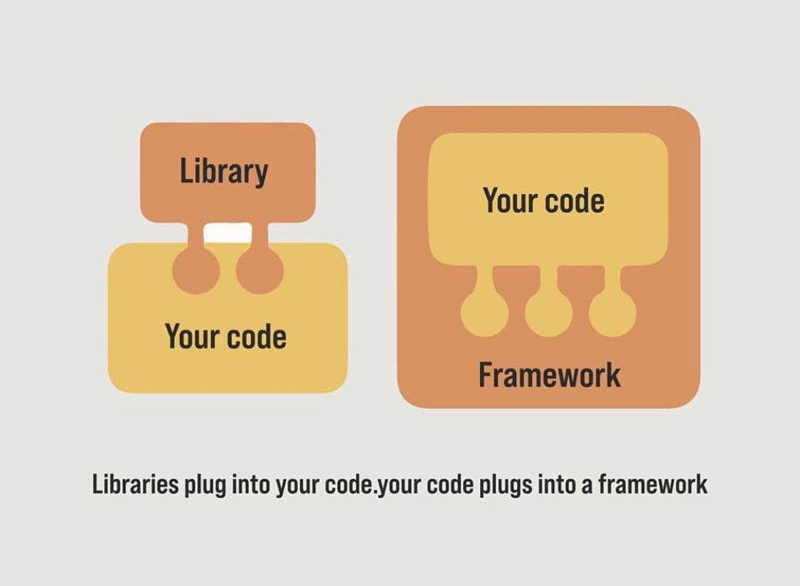

# 1. Vue介绍

::: tip 目标
介绍Vue的概念、特点、版本、基本使用
:::

## 1.1 为什么要学习 `Vue`

* **从GitHub趋势来看，Vue是排在第一位，至少有13万的Star**,它基于HTML的模板语法，响应式的更新机制，可以让我们更快的更高效的开发项目，渐进式的开发理念和繁荣的生态圈为我们提供了大量的最佳实践。
* 目前不管是BAT大厂（BAT是指：中国互联网公司三巨头）还是在创业公司，Vue都有广泛的应用，相关技术原理也成为了我们**面试中必考知识点**。对于任何一个前端工程师来说，它都是一门非常值得我们学习的前端框架。

## 1.2 Vue是什么

Vue (读音 /vjuː/，类似于 view) 是一套用于构建用户界面的**渐进式**框架。
Vue的核心库只关注视图层，不仅易于上手，还便于与第三方库或既有项目整合。
另一方面，当与**现代化的工具链**以及**各种支持类库**结合使用时，Vue 也完全能够为复杂的单页应用提供驱动。


## 1.3 为什么说Vue是框架

为了说明**框架（Framework）和库（Library，简写Lib）的区别**，我们来举一个生活中的例子:

假如我们要买一台电脑，框架为我们提供了已经装好的电脑，我们只要买回来就能用，但前提是你必须把整个电脑要买回来。
另外，我们还必须根据框架设定的使用规则来使用电脑。虽然这样用户可能轻松许多，但会导致很多人用一样的电脑，或你想自定义某个部件将需要修改这个框架。

而库就如自己组装的电脑。库为我们提供了很多部件，我们需要自己组装，如果某个部件库未提供，我们也可以自己做。



也就是: 使用库的时候我们比较随意，想用哪取哪，哪块好用哪，而且把它拿过来可以按照我们的编写意愿来用。但是框架就不一样，我们好像被它控制着，要使用它，就得听它的，按照它的规则来，即使它某些地方我们用不到，或者不喜欢，也不能说什么。

而Vue中的指令就是这样的东西，我们只能用它，所以说Vue是框架

## 1.4 Vue有哪些特点

Vue.js 是一个优秀的前端界面开发 JavaScript 库，它之所以非常火，是因为有众多突出的特点，其中主要的特点有以下几个。

* **门槛低、上手快**:

简单易学，只要稍微会点HTML、CSS、JavaScript基础就能很快上手Vue

* **轻量级的框架**：

相比于React压缩后大概是35kb；Angular压缩后大概是60Kb左右；而Vue压缩后大概是20kb ，所以说更加轻量。

* **双向数据绑定**：

声明式渲染是数据双向绑定的主要体现，同样也是 Vue.js 的核心，它允许采用简洁的模板语法将数据声明式渲染整合进 DOM。

* **丰富的指令系统**：

Vue.js 与页面进行交互，主要就是通过内置指令来完成的，指令的作用是当其表达式的值改变时相应地将某些行为应用到 DOM 上。

* **组件化**：

组件（Component）是 Vue.js 最强大的功能之一。组件可以扩展 HTML 元素，封装可重用的代码。

## 1.5 Vue的版本

当前，vue 共有 3 个大版本，其中:

* 1.x 版本的 vue 几乎被淘汰，不再建议学习与使用
* 2.x 版本的 vue 是目前企业级项目开发中的主流版本,2.x 版本的 vue 在未来(1 ~ 2年内)会被逐渐淘汰;
* 3.x 版本的 vue 于 2020-09-19 发布，生态还不完善，尚未在企业级项目开发中普及和推广,3.x 版本的 vue 是未来企业级项目开发的趋势;

## 1.6 Vue的基本使用

* **Step. 1：** 新建一个HTML文件，在`head`结束标签上面，引入Vue库文件。

```html
<script src="https://unpkg.com/vue@3.2.20/dist/vue.global.js"></script>
```

* **Step. 2：** 在`html`文件的body标签中，创建一个`div`标签，给`div`标签添加`id`属性值为`app`。

```html{3}
<head>
  <!-- 省略代码 -->
  <script src="https://unpkg.com/vue@3.2.20/dist/vue.global.js"></script>
</head>
<body>
  <div id="app"></div>
</body>

```

* **Step. 3：** 在`body`标签中，`div`标签平级下面创建`script标签`，编写以下代码。

```js{3,5}
<script>
  // 创建Vue实例
  const vm = Vue.createApp({});
  // 把Vue实例挂载在id为app的div上
  vm.mount('#app');
</script>
```

* **Step. 4：** 在`createApp`方法中定义数据

```js{3-6}
  // 创建Vue实例
  const vm = Vue.createApp({
    data(){
      return {
        name: "WanLum"
      }
    }
  });
  // 把Vue实例挂载在id为app的div上
  vm.mount('#app');
```

::: warning 注意
Step. 4：中 `data(){return {}}`是固定写法，其中定义的数据是`key:value`的形式
:::

* **Step. 5：** 使用 `插值表达式` 把定义的数据 `name` 展示在`id`为`app`的`div`中。

```html{5}
<!-- 省略代码 -->
<body>
  <div id="app">
    <!-- {{}} 双花括号被称为 插值表达式 -->
    {{ name }}
  </div>
</body>
```

## 1.7 总结

::: danger 总结

* Vue是什么?
* 框架和库的区别是什么?
* Vue基本使用的步骤是什么?
:::
