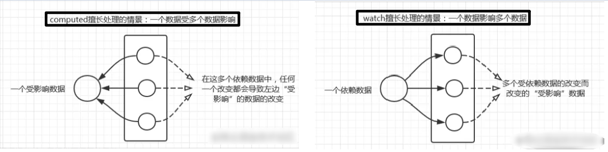

# 5.侦听器

## 5.1 为什么需要侦听器

如果你理解computed计算属性，那么你应该知道，如果一个属性是由其他属性计算而来的，这个属性依赖其他属性，那么一般使用computed,
但是，如果我要监测 data中定义的数据的变化 或 props中数据的变化 怎么办呢？这时候就需要侦听器(watch)了。

## 5.2 侦听器是什么

## 5.3 `immediate`属性

## 5.4 `deep`属性

## 5.5 侦听器和计算属性的区别

## 5.6 总结
