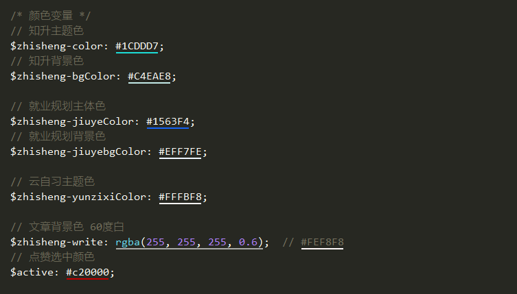

## 代码规范

- 内容相同尽量封装成组件调用，避免切换时出现闪屏现象，影响用户体验。
- 主页功能模块中展示的主要功能，其他页面均放在 `subpkg` 打包文件中，并以 `模块名-` 开头命名。
- 所有的静态资源都放在 `static` 文件中，`font-icon` 文件夹下是字体图标，具体查看 `font-icon` 文件夹下的HTML说明文件。

## 颜色规范

### 主题色

> 所有模块的主题色和背景色都在 `uni.sass` 文件中存储为变量，直接调用即可。

 

### 灰色

> 由深至浅。

| 颜色    | 说明                   |
| ------- | ---------------------- |
| #333333 | 一般用作字体           |
| #808080 | 一个用作图标           |
| #f4f4f4 | 一般用作下划线、下边框 |
| #eeeeee | 一般用作下划线、下边框 |

