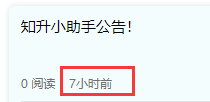

## 动态设置 `navigationBarTitleText` 

```js
// 动态标题
onLoad () {
    uni.setNavigationBarTitle({
        title: '动态名称'
    });
}
```


## 时间格式转换方法调用

> 使用封装好的时间转换方法 `timeago` 。

```js
// 语法格式：
uni.$http.timeago( Date.parse(new Date()) );
```

- 这里的 `new Date()` 代表要转换的时间：`2022-01-15T07:05:37.000Z` 。

- 如果传入的时间是时间戳，那么使用以下格式

  ```js
  // 语法格式：
  uni.$http.timeago(new Date());
  ```

**结果** 

> 格式：`刚刚` 、 `几分钟前` 、 `几小时前` 、 `几天前` 、`几周前` 、 `几月前` 。

 


## 跳转传值

### 传递

> `url` 中的 `data.id` 是要传递的值。

```vue
<script>
	export default {
		methods: {
            urlTo(data) {
				uni.navigateTo({
					url: `../../subpkg/article/article?artId=${data.id}`,
				})
			}
        }
	}
</script>
```

### 接收

> option 就是跳转链接的 `?` 后面跟的值。

```vue
<script>
	export default {
		onLoad(option) {
            console.log(option)
        }
	}
</script>
```


## MySQL 时间转换

1. 时间转为时间戳

   ```mysql
   -- 时间'2019-01-22 15:45:06' 转换成 unix 时间戳
   select UNIX_TIMESTAMP(time) from users;	-- 1642036501
   ```

2. 时间戳转为时间

   ```mysql
   -- unix 时间戳 转换成 '2019-01-22 15:45:06'
   select FROM_UNIXTIME(time) from users; 	-- 2019-01-22 15:45:06
   ```

3. 时间转字符串

   ```mysql
   -- 时间转字符串, 格式化
   select DATE_FORMAT(time,'%Y-%m-%d %H:%i:%s') from users;	-- '2019-01-22 15:45:06'
   ```

   

