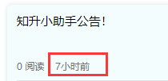

## 时间格式转换方法调用

> 使用封装好的时间转换方法 `timeago` 。

```js
// 语法格式：
uni.$http.timeago( Date.parse(new Date()) );
```

- 这里的 `new Date()` 代表要转换的时间：`2022-01-15T07:05:37.000Z` 。

- 如果传入的时间是时间戳，那么使用以下格式

  ```js
  // 语法格式：
  uni.$http.timeago(new Date());
  ```


**结果** 

 

